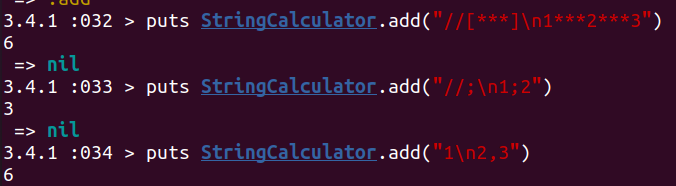

# String Calculator

Task Link: https://blog.incubyte.co/blog/tdd-assessment/

Bonus cases for the task can be found here: https://osherove.com/tdd-kata-1/

**What is this**: A simple **String Calculator** built in **Ruby**, following **Test-Driven Development (TDD)** principles.
It takes a string of numbers, separated by delimiters, and returns their sum.

---

## 🚀 Features

- ✅ Supports **comma-separated numbers** (`"1,2,3"` → `6`)
- ✅ Handles **new lines as delimiters** (`"1\n2,3"` → `6`)
- ✅ Supports **custom delimiters** (`"//;\n1;2"` → `3`)
- ✅ Allows **multiple delimiters** (`"//[*][%]\n1*2%3"` → `6`)
- ✅ Supports **longer delimiters** (`"//[***][%%%]\n1***2%%%3"` → `6`)
- ✅ **Ignores numbers greater than 1000** (`"2,1001"` → `2`)
- ✅ Throws an **exception for negative numbers** (`"-1,2"` → `"negatives not allowed: -1"`)

---

---
Sample tests for output:

---
